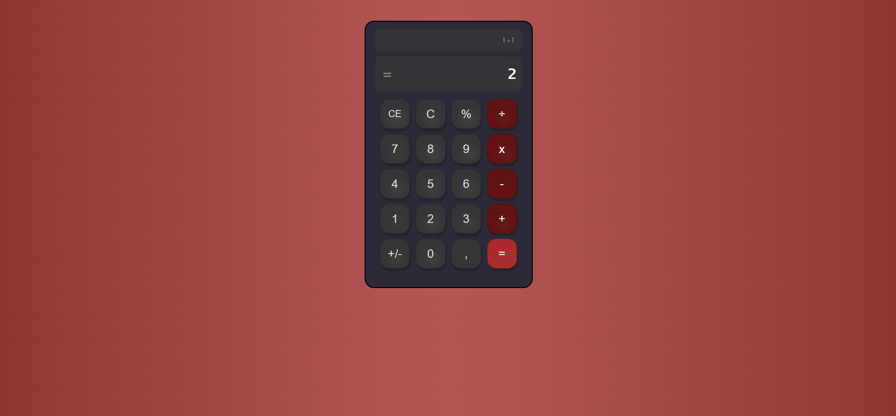

# #🖥️ CALCULADORA

Esse é um projeto final Web desenvolvido durante o curso de Dev Fullstack da Infinity School com o professor Luan Oliveira.

## 🔎

## 🎨 Layout

Você pode visualizar o layout do projeto através
[desse link](https://www.figma.com/file/JkJzlMrZ9sIm7JZZgwwp7L/Calculadora?type=design&node-id=0%3A1&mode=design&t=dQx1ClULG0VYqTa9-1)

### 🧑‍💻 Creditos

